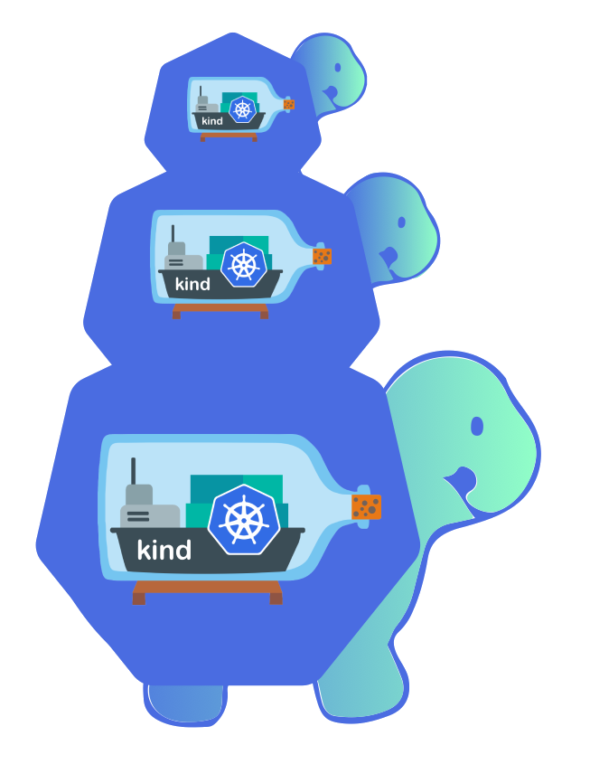

# cluster-api-provider-kind (capk)

Declarative management of [Kind] clusters using Kubernetes resources, leveraging [cluster-api].

## Compatibility / Requirements

* **[cluster-api]** >= v0.4 (Cluster API v1alpha4)
* **[Kind]** >= v0.9.0
* A Kind cluster running at least Kubernetes 1.16

## Features

* Native Kubernetes manifests and API
* Manages the creation of clusters using Kind
* Specify the number of control plane nodes (replicas)
* Choice of Kubernetes version to create
* Specify Kubernetes feature gates and runtime config

## Installation

1. Ensure you already have installed [Kind] and [clusterctl].
2. Create a new Kind cluster to use as the management cluster

    ```sh
    kind create cluster --name management-cluster
    ```

3. Install cluster-api

    ```sh
    clusterctl init
    ```

4. Install cluster-api-provider-kind into the management cluster

    ```sh
    make install deploy
    ```

5. Run the Kind API server on the host machine

    ```sh
    make run-server
    ```

## Limitations

There are a few limitations that you need to be aware of:

* Kind doesn't provide any way of modifying the config of a running cluster so updates to a `KindCluster` have no effect on the underlying cluster.
* Kind requires the Docker binary to function. Kind itself uses CRI / Containerd rather than Docker so the provider requires a REST API server running on the host to interact with Kind.

---

[kind]: https://github.com/kubernetes-sigs/kind
[cluster-api]: https://github.com/kubernetes-sigs/cluster-api/
[clusterctl]: https://cluster-api.sigs.k8s.io/user/quick-start.html#install-clusterctl
